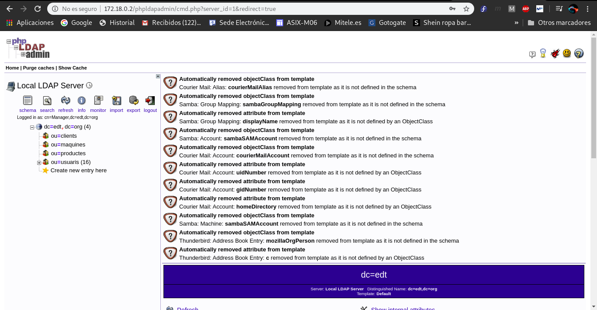
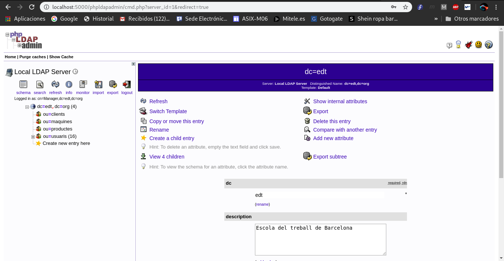

# **The Crazy Thing**
## Gustavo Tello Beltran
### Índex

- [Enunciat: exercici 15 - Ldap-remot i phpldapadmin-local](#Exercici15-ldap-remot-i-phpldapadmin-local)
  - [Ldap-remot a Amazon](#LDAP)
  - [Phpldapadmin local a l'aula o a casa](#PHPLDAPADMIN)
- [Enunciat: ejercicio16: Ldap-local i phpldapadmin-remot](#Ejercicio16-Ldap-local-i-phpldapadmin-remot)
  - [Engegar ldap i phpldapadmin i que tinguin connectivitat](#engegar-ldap-i-phpldapadmin-i-que-tinguin-connectivitat)

#### Exercici15 Ldap remot i phpldapadmin-local

Desplegem dins d’un container Docker (host-remot) en una AMI (host-destí) el servei ldap amb el firewall de la AMI només obrint el port 22. Localment al host de l’aula (host-local) desplegem un container amb phpldapadmin. Aquest container ha de poder accedir a les dades ldap. des del host de l’aula volem poder visualitzar el phpldapadmin.

**Desplegar el servei ldap**

- en el host-remot AMI AWS EC2 engegar un container ldap sense fer map dels ports.
-  en la ami cal obrir únicament el port 22
-  També cal configurar el /etc/hosts de la AMI per poder accedir al container ldap per nom de host (preferentment).
-  verificar que des del host de l’aula (host-local) podem fer consultes ldap.

**Desplegar el servei phpldapadmin**

-  engegar en el host de l’aula (host-local) un container docker amb el servei phpldapadmin fent map del seu port 8080 al host-local (o no).
- crear el túnel directe ssh des del host de l’aula (host-local) al servei ldap (host-remot) connectant via SSH al host AMI (host-destí).
-  configurar el phpldapadmin per que trobi la base de dades ldap accedint al host de l’aula al port acabat de crear amb el túnel directe ssh.
-  Ara ja podem visualitzar des del host de l’aula el servei phpldapadmin, accedint al port 8080 del container phpldapadmin o al port que hem fet map del host de l’aula (si és que ho hem fet).


#### LDAP

__1. Entrem a AWS.__
```
[gustavo@localhost TUNELSSHH]$ ssh -i ~/.ssh/jupiter.pem fedora@35.178.176.81
```

__2. Verifiquem que només es pugui accedir a traves del port 22.__

```
[fedora@ip-172-31-21-40 ~]$ nmap localhost
PORT   STATE SERVICE
22/tcp open  ssh

```

__3. Posem en funcionament el container ldap en detach.__

```
[fedora@ip-172-31-21-40 ~]$ docker run --rm -h ldap --name ldap --net mynet -d isx43577298/k19:kldap
```

__4. Anem al /etc/hosts i afegim el servidor ldap__
```
[fedora@ip-172-31-21-40 ~]$ cat /etc/hosts
127.0.0.1   localhost localhost.localdomain localhost4 localhost4.localdomain4
::1         localhost localhost.localdomain localhost6 localhost6.localdomain6
172.19.0.2	ldap
```

__5. Localment creem un tunel ssh directe al servidor ldap d'Amazon.__

```
[gustavo@localhost TUNELSSHH]$ ssh -i ~/.ssh/jupiter.pem -L 5000:ldap:389 fedora@35.178.176.81

[gustavo@localhost TUNELSSHH]$ ldapsearch -x -h localhost -p 5000 -b 'dc=edt,dc=org'| head -n 15
# extended LDIF
#
# LDAPv3
# base <dc=edt,dc=org> with scope subtree
# filter: (objectclass=*)
# requesting: ALL
#

# edt.org
dn: dc=edt,dc=org
dc: edt
description: Escola del treball de Barcelona
objectClass: dcObject
objectClass: organization
o: edt.org
```
#### PHPLDAPADMIN

__6. Creem el docker amb el phpldapadmin de forma interactiva ja que haurem de modificar la configuració.__

```
[gustavo@localhost TUNELSSHH]$ docker run --name php -h php --net mynet -it isx43577298/ldapserver19:phpldapadmin /bin/bash
```

__7. Creem el tunel directe per accedir al phpldapadmin indicant l'interficie mynet__

```
[gustavo@localhost TUNELSSHH]$ ssh -i ~/.ssh/jupiter.pem  -L 172.18.0.1:5000:ldap:389  fedora@35.178.176.81
```

__8. Configuració docker local phpldapadmin.__

```
[root@php phpldapadmin]# vi config.php
$servers->setValue('server','host','172.18.0.1');
$servers->setValue('server','port',5000);
$servers->setValue('server','base',array('dc=edt,dc=org'));

# Posem en marxa el php
[root@php phpldapadmin]# bash startup.sh
```

__9. Finalment ens conectem des d'un navegador al phpldapadmin:__
```
172.18.0.2/phpldapadmin/

# Fem login:
user:'cn=Manager,dc=edt,dc=org'
password:'secret'
```



## Ejercicio16: Ldap-local i phpldapadmin-remot


Obrir localment un ldap al host. Engegar al AWS un container phpldapadmin que usa el ldap del host de l’aula. Visualitzar localment al host de l’aula el phpldapadmin del container de AWS EC2. Ahí ez nà.

**Engegar ldap i phpldapadmin i que tinguin connectivitat:**

- Engegar localment el servei ldap al host-local de l’aula.

-  Obrir un túnel invers SSH en la AMI de AWS EC2 (host-destí) l ligat al servei ldap del host-local de l’aula.

-  Engegar el servei phpldapadmin en un container Docker dins de la màquina AMI. cal confiurar-lo perquè connecti al servidor ldap indicant-li la ip de la AMI i el port obert per el túnel SSH.

-  **nota** atenció al binding que fa ssh dels ports dels túnels SSH (per defecte són només al localhost).


**Ara** cal accedir des del host de l’aula al port 8080 del phpldapadmin per visualitzar-lo. Per fer-ho cal:

- en la AMI configutat el /etc/hosts per poder accedir per nom de host (per exemple php) al port apropiat del servei phpldapadmin.
- establir un túnel directe del host de l’aula (host-local) al host-remo t phpldapadmin passant pel host-destí (la AMI).
-  Ara amb un navegador ja podem visualitzar localment des del host de l’aula el phpldapadmin connectant al pot directe acabat de crear.
- **nota** atenció al binding que fa ssh dels ports dels túnels SSH (per defecte són només al localhost).


### Engegar ldap i phpldapadmin i que tinguin connectivitat

__1. Posem en funcionament el container de ldap en detach__

```
[gustavo@localhost ~]$ docker run --rm -h ldap --name ldap --net mynet -d isx43577298/k19:kldap
```

__2. Configurem el /etc/hosts el servidor ldap__

```
[root@localhost ~]# cat /etc/hosts
127.0.0.1   localhost localhost.localdomain localhost4 localhost4.localdomain4
::1         localhost localhost.localdomain localhost6 localhost6.localdomain6
172.18.0.2	ldap
```

__3. En el fitxer /etc/ssh/sshd_config canviem l'opcio GatewayPorts i
posarem yes. D'aquesta manera els tunnels inversos poden fer bind en diferents interficies, per defecte només permet localhost.__

```
[fedora@ip-172-31-21-40 ~]$ sudo vim /etc/ssh/sshd_config
Gateway yes
```

__4. Engeguem un container phpldapadmin interactivament.__

```
[fedora@ip-172-31-21-40 ~]$  docker run --rm --name php -h php --net mynet -it isx43577298/ldapserver19:phpldapadmin /bin/bash
```

__5. Creem un tunnel ssh invers cap a la maquina de amazon per a que phpldapadmin pugui fer consultes a la base de dades de ldap.__

```
[gustavo@localhost ~]$ ssh -i ~/.ssh/jupiter.pem -R 172.19.0.1:5000:ldap:389 fedora@35.178.176.81
```

__6. Configuració phpldapadmin.__

```
[root@php phpldapadmin]# vi config.php
$servers->setValue('server','host','172.18.0.1');
$servers->setValue('server','port',5000);
$servers->setValue('server','base',array('dc=edt,dc=org'));

# Poso en marxa el php
[root@php phpldapadmin]# bash startup.sh
```

__7. Un cop configurat el php, anem a la maquina local i creem un tunnel ssh directe del hostlocal pasant pel hostdesti(aws) redireccionat a 172.18.0.2:80 del docker d'Amazon.__

```
[gustavo@localhost ~]$ ssh -i ~/.ssh/jupiter.pem -L 7000:172.18.0.2:80 fedora@35.178.176.81
```

__8. Comprovació de que podem accedir al phpldapadmin.__  
```
localhost:5000/phpldapadmin/

# Fem login:
user:'cn=Manager,dc=edt,dc=org'
password:'secret'
```


